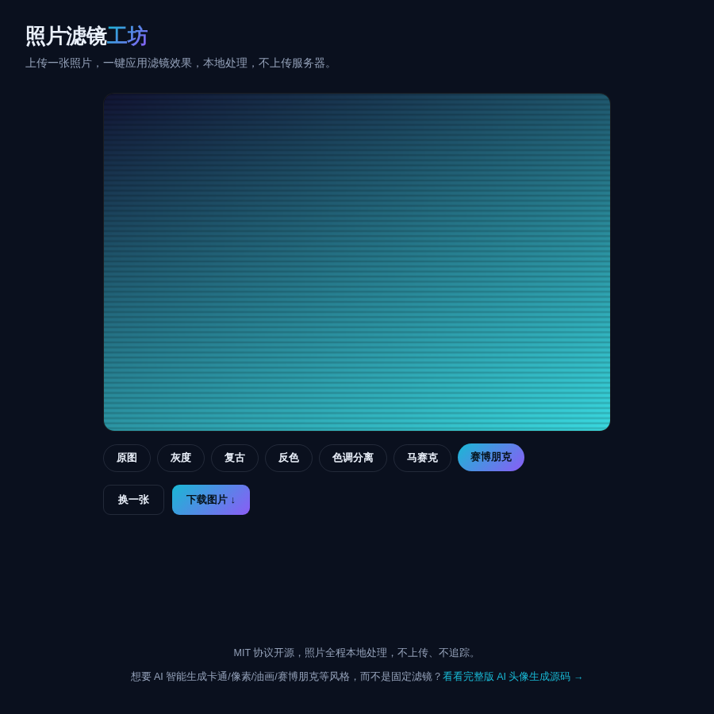

# 照片滤镜工坊 · Photo Filters

**[在线体验 →](https://anna123123123-creator.github.io/photo-filters/)**

免费开源、纯浏览器运行的照片滤镜小工具：上传一张照片，一键应用灰度、复古、反色、色调分离、马赛克、赛博朋克等滤镜效果，处理完直接下载。全部在你的浏览器本地用 Canvas 处理，不上传服务器、不追踪。



## 试用方法

直接用浏览器打开 `index.html`，或者用静态文件服务器跑起来：

```bash
python3 -m http.server 8000
```

## 实现原理

所有滤镜都是对 Canvas `ImageData` 做逐像素运算：
- **灰度**：亮度加权平均
- **复古**：经典 sepia 矩阵变换
- **反色**：`255 - value`
- **色调分离**：把每个通道量化到固定档位
- **马赛克**：分块取平均色
- **赛博朋克**：按亮度做双色调映射 + 扫描线

`script.js` 里大概 150 行原生 JavaScript，没有用任何图像处理库。

## 协议

MIT。

## 需要定制版？

这个工具免费开源、可以直接用。如果你需要的是**改造成适合自己业务的版本**——换品牌、改字段、加功能、接后端或数据库——我可以做。

- **交付周期**：3–10 个工作日
- **交付内容**：完整源码（不加密、可自行二次开发）+ 在线地址 + 部署说明
- **已有 49 套现成系统**可直接改造，覆盖电商、教育、门店、内容、跨境等行业：[全部清单与在线演示](https://inzyxuashop.com)

把你的需求发给我，24 小时内回复可行性与报价：**evcdecd@gmail.com**
